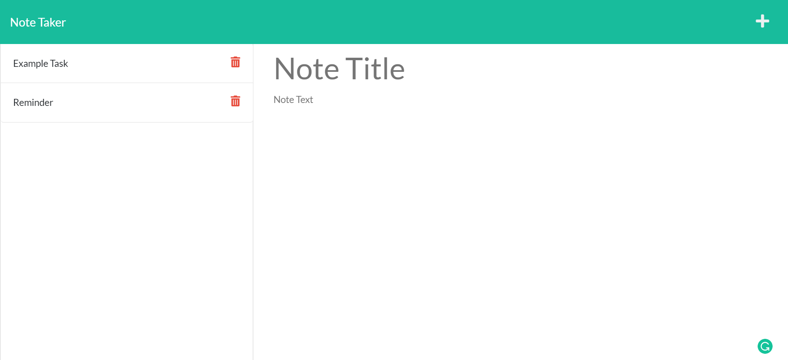

# Note-Taker-SMM

This project is a homework assignment for Rutgers Coding Bootcamp.

## Description
When the user opens the Note Taker in browser, they are presented with a landing page with a link to the notes page. The link will bring the user to the actual note page with existing notes listed in the left-hand column, in addition to fields in which a user can enter a note to the right-hand column. If a new note title and note text is entered, then a save icon will appear in the navigation bar. 

When the user clicks the save icon, the new note entered is saved and appears in the left hand column with other existing notes. If an existing note is clicked then that note appears in the right-hand column. Finally, when the user clicks the write icon in the navigation bar, then they are presented with empty fields to enter a new note title and text.

## Table of Contents 

* [Deploy](#deploy)
* [Technologies Used](#technologies-used)
* [Usage](#usage)
* [Notes](#notes)
* [Contributions](#contributions)
* [Licenses](#licenses)

## Deploy

This webpage will only run if the application's server is active. Click this link to be brought to the Note Taker page: 

* http://localhost:3001/notes

## Technologies Used

* HTML
* JavaScript
* CSS
* Node.js
* Express.js

## Usage 

First the user must start the application through use of the command line. Enter: npm start, to start the server. Finally, click the link provided in the [Deploy](#deploy) section to be taken to the page's url in-browser. 

### Full Page

### Note Page

### Note Page with Note

## Notes
This application uses Express.js and Node.js. The modularization of each file was difficult to grasp in addition to attempting to connect the front-end files to the back-end. 

## Contributions
N/A

## Licenses
N/A
